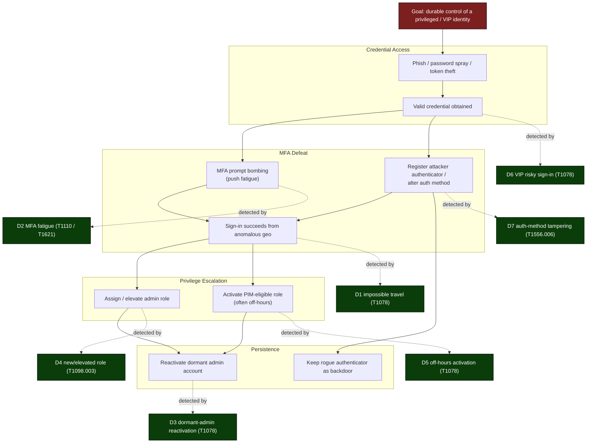
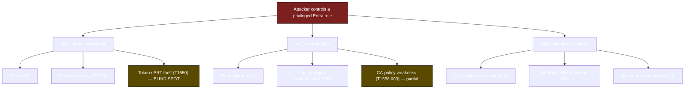

# MITRE ATT&CK Coverage — blueteamthreathunting v0.1.0

Static, reviewable map of what this identity threat-hunting pack detects. It binds each of the
seven v0.1.0 detections to a **MITRE ATT&CK** tactic + technique, the **Zero Trust (ZT) pillar**
it supports, and the primary **Microsoft Sentinel** table(s) it queries. The workbook renders a
live view; this file is the canonical, version-controlled source for the README detection list
and the `analytics-rules/` technique mappings.

> Scope: privileged and VIP-flagged identities in Microsoft Entra ID. No live tenant —
> templates + docs only. Thresholds named here are starting points and are tunable
> (see `docs/tuning-notes.md`).

> Acronyms on first use: MITRE ATT&CK = MITRE Adversarial Tactics, Techniques, and Common
> Knowledge. ZT = Zero Trust. MFA = multi-factor authentication. PIM = Privileged Identity
> Management. UEBA = User and Entity Behavior Analytics. CA = Conditional Access.

---

## 1. Coverage table

ZT pillars: **VE** = Verify Explicitly · **LP** = Use Least Privilege · **AB** = Assume Breach.

| ID | Detection | Tactic | Technique (ID) | More-precise sub-technique | ZT pillar | Primary Sentinel table(s) | Severity | Requires UEBA |
|----|-----------|--------|----------------|----------------------------|-----------|---------------------------|----------|---------------|
| D1 | Impossible travel | Initial Access | Valid Accounts (T1078) | T1078.004 Cloud Accounts | Assume Breach | `SigninLogs` | High | N |
| D2 | MFA fatigue / repeated denials | Credential Access | Brute Force (T1110) | **T1621** MFA Request Generation *(see note)* | Verify Explicitly | `SigninLogs` | High | N |
| D3 | Dormant-admin reactivation | Persistence | Valid Accounts (T1078) | T1078.004 Cloud Accounts | Assume Breach | `SigninLogs` + `AuditLogs` | Medium | N |
| D4 | New / elevated admin-role assignment | Privilege Escalation | Account Manipulation (T1098) | T1098.003 Additional Cloud Roles | Use Least Privilege | `AuditLogs` | High | N |
| D5 | Off-hours privileged role activation | Defense Evasion | Valid Accounts (T1078) | T1078.004 Cloud Accounts | Use Least Privilege | `AuditLogs` (PIM) / `SigninLogs` | Medium | N |
| D6 | VIP risky sign-ins | Initial Access | Valid Accounts (T1078) | T1078.004 Cloud Accounts | Verify Explicitly | `SigninLogs` (`RiskLevelDuringSignIn`) | High | Y |
| D7 | MFA / auth-method tampering | Credential Access | Modify Authentication Process (T1556) | T1556.006 MFA · T1098.005 Device Registration | Verify Explicitly | `AuditLogs` | High | N |

### Mapping notes (be honest about these)

- **D2 technique ID.** The acceptance criteria and the deployable analytics rule map MFA fatigue
  to **T1110 (Brute Force, Credential Access)** so the README, hunting YAML, and ARM rule stay
  consistent. The *more accurate* current ATT&CK technique for push-bombing / prompt-flooding is
  **T1621 — Multi-Factor Authentication Request Generation** (Credential Access). Treat T1110 as
  the locked v0.1.0 mapping and T1621 as the upgrade target for v0.2.0.
- **T1078 tactic spread.** T1078 Valid Accounts is one technique that legitimately spans four
  tactics (Initial Access, Persistence, Privilege Escalation, Defense Evasion). That is why
  D1/D3/D5/D6 share a technique ID but carry different tactics — the tactic, not the ID,
  distinguishes them. This is intentional, not a copy/paste error.
- **D7 dual sub-technique.** Adding an attacker-controlled authenticator is best modeled as
  **T1556.006 (MFA)**; if the tampering takes the form of registering a new device/authenticator
  for persistence, **T1098.005 (Device Registration)** also applies. The rule's primary technique
  stays T1556.
- **T1550 / T1021 in scope?** PLAN.md lists **T1550 (Use Alternate Authentication Material)** and
  **T1021 (Remote Services)** in the technique palette, but **no v0.1.0 detection maps to them.**
  Token-theft / pass-the-PRT (T1550) and lateral movement (T1021) are out of scope here — listed
  as blind spots in section 3 so the gap is explicit rather than implied-covered.

### ZT pillar rollup

| ZT pillar | Detections | What it asserts |
|-----------|-----------|-----------------|
| Verify Explicitly | D2, D6, D7 | Authenticate/authorize on every signal — risk level, MFA integrity, auth-method changes. |
| Use Least Privilege | D4, D5 | Just-enough / just-in-time access — role grants and off-hours PIM activations are scrutinized. |
| Assume Breach | D1, D3 | Presume compromise — geovelocity and dormant-account reuse imply an active intruder. |

---

## 2. Identity attack-path narrative (privileged / VIP accounts)

How a single phished VIP or admin credential walks the kill chain, and where each detection
(D1–D7) is positioned to catch it. Read top-to-bottom as the adversary's path; the dashed lines
show which detection fires at each stage.

**Reading the path.** Credential access (phish/spray) yields a valid credential. The adversary
then defeats MFA either by fatigue (D2) or by registering their own authenticator (D7); the
resulting sign-in often trips geovelocity (D1) or risk scoring (D6). With a session in hand they
escalate by granting themselves a role (D4) or activating a PIM-eligible role off-hours (D5),
then persist by reusing a dormant admin (D3) or leaving the rogue authenticator in place (E2).
**The watchlist boost is what makes this actionable:** an account present in **both** `VIPUsers`
and `PrivilegedAccounts` scores highest, so a single identity walking three or more of these
stages surfaces at the top of the queue.

### Top-risk attack tree (privilege escalation via compromised VIP/admin)

The two amber leaves (token/PRT theft, CA-policy tampering) are paths the attacker can take that
v0.1.0 does **not** reliably catch — see blind spots below.

---

## 3. Known blind spots — what v0.1.0 does NOT cover

Being explicit so reviewers do not assume coverage that is not there.

| Gap | Technique(s) | Why uncovered in v0.1.0 | Backlog target |
|-----|-------------|--------------------------|----------------|
| Token / PRT theft, pass-the-cookie | T1550 / T1550.001 / T1528 | Needs token-binding + sign-in session-ID correlation; no detection authored. | v0.2.0 |
| Lateral movement after compromise | T1021 (Remote Services) | Out of identity scope; needs `SecurityEvent` / device telemetry not in this pack. | Separate pack |
| Conditional Access policy tampering | T1556.009 | D7 watches auth methods, not CA-policy `AuditLogs` change events. | v0.2.0 |
| OAuth / app-consent grant abuse | T1098.001 (Additional Cloud Credentials), illicit consent | No detection for service-principal credential adds or consent grants. | v0.2.0 |
| Federation / hybrid-identity backdoors | T1556.007 (Hybrid Identity), T1484.002 | Needs federation-trust + AD FS telemetry; cloud-only scope here. | Future |
| MFA-fatigue precise mapping | T1621 vs locked T1110 | D2 intentionally locked to T1110 for ARM-rule consistency; T1621 deferred. | v0.2.0 |
| Service-principal / managed-identity abuse | T1078.004 (non-interactive) | Detections center on interactive user sign-ins; SP sign-in logs not modeled. | v0.2.0 |
| UEBA-dependent fidelity | — | D6 needs Entra Identity Protection / `BehaviorAnalytics`; degrades to raw risk columns if UEBA absent. | Tenant-dependent |

**Detection-confidence caveats inside scope:** D1 (impossible travel) yields false positives on
VPN/corporate-proxy egress and cloud-hosted clients; D5 (off-hours) is timezone-sensitive and
noisy for follow-the-sun admins. Both are tuned, not eliminated — see `docs/tuning-notes.md`.

---

*Maintained by the threat-modeler step. Technique IDs verified against attack.mitre.org
(T1078, T1098, T1110, T1556 and sub-techniques) on 2026-06-15. Review with the blue team each
release. Drives: README detection list, `analytics-rules/` `techniques` arrays, hunting-query
`relevantTechniques`.*
