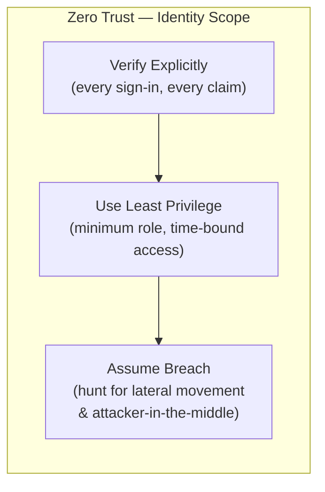
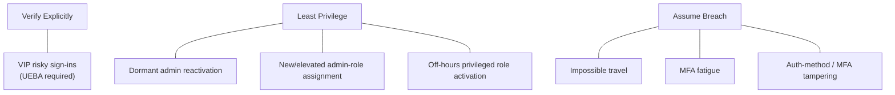

# Zero Trust Identity Model — `blueteamthreathunting` v0.1.0

> **Audience:** detection engineers, threat hunters, and reviewers working in this repo.
> This document defines the model they must implement — not the queries themselves.
> All thresholds noted below are tunable starting points; change them in the relevant
> artifact and record the reason in `docs/tuning-notes.md`.

---

## 1. The Three Zero Trust Pillars

Zero Trust (ZT) rejects the idea of an implicit "trusted" network perimeter. Every
access decision is evaluated continuously, with the minimum rights needed, on the
assumption that a breach may already have occurred. Microsoft's ZT framework expresses
this as three principles. This repo applies all three specifically to **identity** in
Microsoft Entra ID (formerly Azure Active Directory).



### 1.1 Verify Explicitly

**Principle:** Authenticate and authorize on every request using all available signals —
location, device health, user risk score, MFA result. Never rely on network location alone.

**What breaks it:** sign-ins that bypass Conditional Access (CA), legacy authentication
protocols (SMTP AUTH, basic auth), MFA fatigue attacks where a user is worn down into
approving a push they did not initiate, and undetected risky sign-ins from compromised
credentials.

**Sentinel tables that feed this pillar:**

| Table | What it contributes |
|-------|---------------------|
| `SigninLogs` | Interactive sign-ins: CA policy outcome, MFA result, sign-in risk level, IP/location |
| `AADNonInteractiveUserSignInLogs` | Service-principal and non-interactive flows that bypass MFA prompts; high blind-spot risk |
| `AADUserRiskEvents` | Risk detections from Entra Identity Protection (leaked credentials, atypical travel, etc.) |
| `AADRiskyUsers` | Aggregated user risk state (`high`, `medium`, `low`, `none`) at the account level |
| `BehaviorAnalytics` | UEBA-derived peer-group baselines; confirms whether a sign-in is anomalous vs. normal for that user |

### 1.2 Use Least Privilege

**Principle:** Grant the minimum role needed for the minimum time. Privileged access must
be explicit, audited, and regularly reviewed. Standing, permanent admin access is a risk.

**What breaks it:** Privilege creep (roles accumulate over time and are never revoked),
dormant admin accounts that are later reactivated by an attacker, and role assignments
made outside the approved Privileged Identity Management (PIM) workflow.

**Sentinel tables that feed this pillar:**

| Table | What it contributes |
|-------|---------------------|
| `AuditLogs` | Directory audit events: role assignments (`Add member to role`), role removals, PIM activation/deactivation |
| `SigninLogs` | Sign-ins from dormant accounts (cross-join with `AuditLogs` to confirm actual activity gap) |
| `IdentityInfo` | UEBA-enriched account attributes: department, job title, assigned roles — used to verify assignment legitimacy |

### 1.3 Assume Breach

**Principle:** Operate as if a threat actor already has valid credentials inside the
environment. Focus detection on post-authentication behaviors: impossible-speed travel
between locations, authentication-method tampering to establish persistence, and
off-hours role activations that hide attacker activity in low-noise windows.

**What breaks it:** Telemetry gaps (non-interactive logs not onboarded), UEBA not
enabled, no watchlist context to distinguish routine admin work from attacker impersonation
of a privileged account.

**Sentinel tables that feed this pillar:**

| Table | What it contributes |
|-------|---------------------|
| `SigninLogs` | Location/IP sequences for impossible-travel detection; MFA deny storms for fatigue detection |
| `AuditLogs` | MFA method changes (`UpdateStrongAuthenticationPhoneAppDetail`, etc.) indicating credential persistence |
| `BehaviorAnalytics` | Anomaly scores and `InvestigationPriority` from UEBA; confirms whether behavior is truly out-of-character |
| `AADUserRiskEvents` | Atypical-travel and anomalous-token detections from Entra Identity Protection |

---

## 2. Watchlist Data Design

Two watchlists provide the identity context that Sentinel logs alone cannot supply.
They are the bridge between raw telemetry and business risk — knowing that a sign-in
belongs to a C-suite executive or a Global Administrator changes its priority
significantly.

### 2.1 VIPUsers Watchlist

**Sentinel alias:** `VIPUsers`
**Search key (primary join key):** `UserPrincipalName`
**Secondary join key:** `ObjectId`

#### Column Schema

| Column | Type | Required | Description |
|--------|------|----------|-------------|
| `UserPrincipalName` | string | Yes — primary key | UPN in `user@domain.com` form. Must match the value in `SigninLogs.UserPrincipalName` exactly (case-insensitive). |
| `ObjectId` | string (GUID) | Yes — secondary key | Entra Object ID. Used as a fallback join when UPN changes (rename, domain migration). |
| `DisplayName` | string | Yes | Human-readable name for workbook display and alert enrichment. |
| `Department` | string | Recommended | Business unit / department. Used for peer-group context in workbook tiles. |
| `VIPReason` | string | Yes | Why this account is VIP: `Executive`, `BoardMember`, `LegalCounsel`, `ITSecurityLead`, `KeyVendor`, or a custom label. |
| `Notes` | string | No | Free text — change history, ticket references, review date. |

#### Sample `_GetWatchlist()` Call Pattern

```kql
// Retrieve all VIP accounts from the watchlist
let VIPList = _GetWatchlist("VIPUsers")
    | project UPN = UserPrincipalName,
              ObjId = ObjectId,
              VIPReason;
```

> **Note on dynamic hydration:** For v0.1.0 this watchlist is a hand-maintained static
> CSV. A future enhancement will hydrate it automatically by joining against
> `IdentityInfo` and filtering on job-title or department patterns. Document that
> enhancement in a GitHub Issue rather than adding scope to v0.1.0.

---

### 2.2 PrivilegedAccounts Watchlist

**Sentinel alias:** `PrivilegedAccounts`
**Search key (primary join key):** `UserPrincipalName`
**Secondary join key:** `ObjectId`

#### Column Schema

| Column | Type | Required | Description |
|--------|------|----------|-------------|
| `UserPrincipalName` | string | Yes — primary key | UPN. Must match `AuditLogs` and `SigninLogs` values exactly. |
| `ObjectId` | string (GUID) | Yes — secondary key | Entra Object ID. Critical for PIM events where UPN may not appear. |
| `DisplayName` | string | Yes | Human-readable name. |
| `AssignedRole` | string | Yes | Entra role display name, e.g. `Global Administrator`, `Privileged Role Administrator`, `Security Administrator`. |
| `RoleSource` | string | Yes | One of three values: `Static` (permanently assigned), `PIM-eligible` (can activate but not currently active), `PIM-active` (actively activated). |
| `Notes` | string | No | Free text — ticket reference, review date, justification. |

> **RoleSource values are meaningful for detection.** A `PIM-eligible` account that
> signs in during off-hours without a PIM activation event in `AuditLogs` is a
> stronger anomaly signal than a `Static` admin doing the same thing.

#### Sample `_GetWatchlist()` Call Pattern

```kql
// Retrieve all privileged accounts from the watchlist
let PrivList = _GetWatchlist("PrivilegedAccounts")
    | project UPN = UserPrincipalName,
              ObjId = ObjectId,
              AssignedRole,
              RoleSource;
```

> **Note on dynamic hydration:** For v0.1.0 this watchlist is a static CSV template.
> A future enhancement will auto-refresh it from PIM eligible/active role assignments
> queried via `IdentityInfo` or the MS Graph API. Document as a v0.2.0 backlog item.

---

### 2.3 Join Keys and Join Strategy

Both watchlists share the same two-level join strategy:

```
Primary join:  SigninLogs.UserPrincipalName  ==  Watchlist.UserPrincipalName
Secondary join: SigninLogs.UserId            ==  Watchlist.ObjectId
```

Use `leftouter` joins so that events for accounts not on either watchlist still
appear in query results — absence from the watchlist is not a filter, it is an
absence of the boost. The secondary join on `ObjectId` guards against UPN changes
caused by domain renames or account migrations.

---

### 2.4 Additive VIP + Privileged Risk Boost

The scoring model is **tag-based and additive**. Each detection query computes a
`RiskScore` integer and a `RiskLabel` string. Watchlist membership adds fixed
increments on top of the base detection score.

#### Boost Table

| Account status | Score increment | Label suffix |
|----------------|----------------|--------------|
| Not on either watchlist | +0 | _(none)_ |
| On `VIPUsers` only | +10 | `[VIP]` |
| On `PrivilegedAccounts` only | +10 | `[PRIV]` |
| On **both** watchlists | +25 | `[VIP+PRIV — HIGHEST PRIORITY]` |

> **Tunable:** The +10 and +25 increments are starting points. Adjust them in each
> hunting-query YAML under the `tuneThresholds` key and update `docs/tuning-notes.md`.
> The intent is that a dual-tagged account always outranks a singly-tagged one, and
> a singly-tagged account always outranks an untagged one, regardless of the base score.

#### Worked Join Example

The following pattern must be followed by every detection query that applies the boost.
The variable names (`VIPList`, `PrivList`, `IsVIP`, `IsPriv`, `RiskScore`) are
**standardized** so reviewers can confirm boost logic at a glance.

```kql
// ── Watchlist lookups ──────────────────────────────────────────────────────
let VIPList = _GetWatchlist("VIPUsers")
    | project UPN = UserPrincipalName, ObjId = ObjectId, VIPReason;

let PrivList = _GetWatchlist("PrivilegedAccounts")
    | project UPN = UserPrincipalName, ObjId = ObjectId, AssignedRole, RoleSource;

// ── Base detection result (example: risky sign-in) ─────────────────────────
let BaseEvents = SigninLogs
    | where RiskLevelDuringSignIn in ("high", "medium")
    | project TimeGenerated, UserPrincipalName, UserId,
              IPAddress, Location, RiskLevelDuringSignIn;

// ── Apply watchlist joins ───────────────────────────────────────────────────
BaseEvents
| join kind=leftouter (VIPList)  on $left.UserPrincipalName == $right.UPN
| join kind=leftouter (PrivList) on $left.UserPrincipalName == $right.UPN
// ── Compute boolean membership flags ───────────────────────────────────────
| extend IsVIP  = isnotempty(VIPReason),
         IsPriv = isnotempty(AssignedRole)
// ── Additive score boost ────────────────────────────────────────────────────
// TUNABLE: base score 0; VIP +10; Priv +10; both +25 (not cumulative — use iff)
| extend RiskBoost = case(
    IsVIP and IsPriv, 25,
    IsVIP or  IsPriv, 10,
    0)
| extend RiskScore = RiskBoost   // Detection engineers add their base score here
| extend RiskLabel = case(
    IsVIP and IsPriv, strcat(UserPrincipalName, " [VIP+PRIV — HIGHEST PRIORITY]"),
    IsVIP,            strcat(UserPrincipalName, " [VIP]"),
    IsPriv,           strcat(UserPrincipalName, " [PRIV]"),
    UserPrincipalName)
// ── Surface highest-priority accounts first ─────────────────────────────────
| sort by RiskScore desc, TimeGenerated desc
| project TimeGenerated, RiskLabel, RiskScore,
          AssignedRole, RoleSource, VIPReason,
          IPAddress, Location, RiskLevelDuringSignIn
```

> **Key design rule:** Use `iff` (case, not cumulative addition) for the boost so that
> a dual-tagged account gets exactly +25, not +10+10 = +20. The dual-tag score must
> always exceed the single-tag score. Detection engineers must not change this rule
> without updating this doc.

---

## 3. Detection-to-Pillar Mapping

Each of the seven hunting queries maps to exactly one primary ZT pillar. Some detections
provide supporting evidence for a second pillar (noted in parentheses).

| # | Detection | Artifact file | Primary pillar | Supporting pillar | Tables used | Requires UEBA |
|---|-----------|---------------|----------------|-------------------|-------------|---------------|
| 1 | Impossible travel | `impossible-travel.yaml` | Assume Breach | Verify Explicitly | `SigninLogs` | No |
| 2 | MFA fatigue / repeated denials | `mfa-fatigue.yaml` | Assume Breach | Verify Explicitly | `SigninLogs` | No |
| 3 | Dormant admin reactivation | `dormant-admin-reactivation.yaml` | Least Privilege | Assume Breach | `SigninLogs`, `AuditLogs` | No |
| 4 | New / elevated admin-role assignment | `new-elevated-admin-role.yaml` | Least Privilege | — | `AuditLogs` | No |
| 5 | Off-hours privileged role activation | `off-hours-privileged-role-activation.yaml` | Least Privilege | Assume Breach | `AuditLogs`, `SigninLogs` | No |
| 6 | VIP risky sign-ins | `vip-risky-sign-ins.yaml` | Verify Explicitly | Assume Breach | `SigninLogs`, `BehaviorAnalytics` | **Yes** |
| 7 | Auth-method / MFA tampering | `mfa-auth-method-tampering.yaml` | Assume Breach | Verify Explicitly | `AuditLogs` | No |

### Pillar-level summary



### Rationale for pillar assignment

**Verify Explicitly — VIP risky sign-ins (D6):** The detection's primary question is
"should we trust this sign-in?" — that is the definition of Verify Explicitly. The
dependency on `BehaviorAnalytics` peer-group baselines and Entra Identity Protection
risk scores is what makes this signal rich but UEBA-dependent.

**Least Privilege — dormant admin, role assignment, off-hours activation (D3/D4/D5):**
All three focus on whether the right roles exist, who has them, and whether activation
patterns match approved business hours. These are standing-privilege hygiene questions.

**Assume Breach — impossible travel, MFA fatigue, auth-method tampering (D1/D2/D7):**
All three assume valid credentials may already be in attacker hands and look for
behavioral proof: physically impossible movement between sessions, a push-bombing
campaign, and persistence via method registration. These are post-authentication
attack-pattern questions.

---

## 4. Scoring and Boost Logic — Plain Language Summary

1. **Every event starts at zero.** The base detection logic (speed, threshold count,
   inactivity window, etc.) does not inherently carry a numeric score in v0.1.0 — the
   boost table provides the differentiation for prioritization.

2. **Watchlist membership adds fixed increments.** VIP-only or Privileged-only accounts
   each receive +10. An account on both watchlists receives +25 (not +20). The gap
   between 20 and 25 is intentional: dual-tagged accounts must always sort above
   singly-tagged accounts.

3. **Sort order is the output.** Queries sort `by RiskScore desc, TimeGenerated desc`.
   This means the most sensitive accounts with the freshest events surface at the top of
   every result set.

4. **Analysts override the sort.** A human reviewer may decide that a +0 (untagged)
   event is more severe than a +25 event based on context. The score is a triage aid,
   not a hard severity assignment. Alert severity in analytics rules is set separately
   in the ARM template and should reflect the detection type's worst-case impact.

5. **Boost increments are tunable** — change the `case()` constants in each query and
   record the new values in `docs/tuning-notes.md`. Never change the rule that
   dual-tag > single-tag > no-tag.

---

## 5. Requires UEBA — Callout

The following signals require **Microsoft Sentinel User and Entity Behavior Analytics
(UEBA)** to be enabled in the Sentinel workspace. Without UEBA, the listed tables are
empty or absent and the queries will return no results or error.

| Signal / query | Table dependency | What to do if UEBA is absent |
|----------------|-----------------|------------------------------|
| VIP risky sign-ins (D6) | `BehaviorAnalytics` (anomaly scores, `InvestigationPriority`) | Remove the `BehaviorAnalytics` join; the query degrades to a pure `SigninLogs` + Identity Protection risk-level filter. Add a comment in the query marking the removed section `// UEBA-DISABLED`. |
| Any query using peer-group baselines | `BehaviorAnalytics` | Same as above. |
| Role legitimacy enrichment | `IdentityInfo` | Remove the `IdentityInfo` join; lose department/job-title context columns. Results remain valid but less enriched. |

**How to enable UEBA:** In the Azure portal, navigate to Microsoft Sentinel →
Configuration → Settings → UEBA and toggle entity types (Users, Devices). Note that
`IdentityInfo` is populated by the UEBA engine on a scheduled refresh cycle
(approximately every 24 hours), not in real time.

> All other six detections (D1–D5, D7) function without UEBA using only
> `SigninLogs` and `AuditLogs`, which are always populated when the Microsoft Entra ID
> (formerly Azure Active Directory) data connector is enabled.

---

## 6. Table Reference Quick Card

| Table | Pillar(s) | Populated by | UEBA required? |
|-------|-----------|--------------|----------------|
| `SigninLogs` | VE, LP, AB | Entra ID connector | No |
| `AADNonInteractiveUserSignInLogs` | VE | Entra ID connector | No |
| `AuditLogs` | LP, AB | Entra ID connector | No |
| `AADUserRiskEvents` | VE, AB | Identity Protection / Entra ID connector | No |
| `AADRiskyUsers` | VE | Identity Protection / Entra ID connector | No |
| `IdentityInfo` | LP | UEBA engine (Sentinel) | **Yes** |
| `BehaviorAnalytics` | VE, AB | UEBA engine (Sentinel) | **Yes** |

---

*Authored by iam-engineer — 2026-06-15. Template document — not production-ready.
All thresholds are tunable; record changes in `docs/tuning-notes.md`.*
